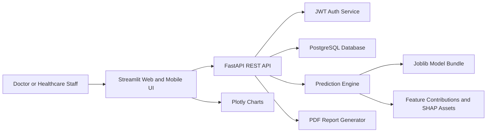

# Architecture Diagram

```mermaid
flowchart LR
    User["Doctor or Healthcare Staff"] --> UI["Streamlit Web and Mobile UI"]
    UI --> API["FastAPI REST API"]
    API --> Auth["JWT Auth Service"]
    API --> DB["PostgreSQL Database"]
    API --> ML["Prediction Engine"]
    ML --> Models["Joblib Model Bundle"]
    ML --> Explain["Feature Contributions and SHAP Assets"]
    API --> PDF["PDF Report Generator"]
    UI --> Charts["Plotly Charts"]
```

