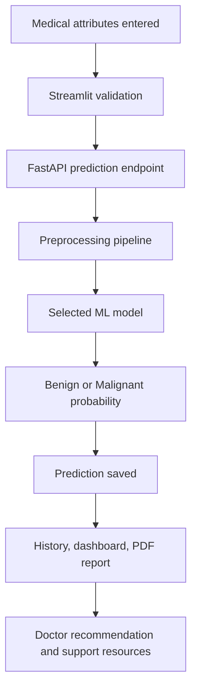

# Data Flow Diagram

```mermaid
flowchart TD
    A["Medical attributes entered"] --> B["Streamlit validation"]
    B --> C["FastAPI prediction endpoint"]
    C --> D["Preprocessing pipeline"]
    D --> E["Selected ML model"]
    E --> F["Benign or Malignant probability"]
    F --> G["Prediction saved"]
    G --> H["History, dashboard, PDF report"]
    H --> I["Doctor recommendation and support resources"]
```

