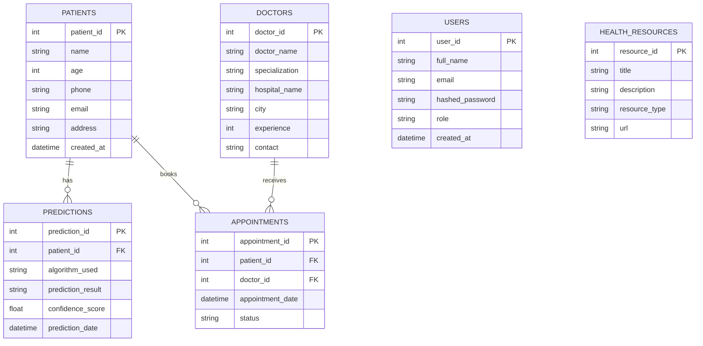

# ER Diagram

```mermaid
erDiagram
    PATIENTS ||--o{ PREDICTIONS : has
    PATIENTS ||--o{ APPOINTMENTS : books
    DOCTORS ||--o{ APPOINTMENTS : receives
    USERS {
        int user_id PK
        string full_name
        string email
        string hashed_password
        string role
        datetime created_at
    }
    PATIENTS {
        int patient_id PK
        string name
        int age
        string phone
        string email
        string address
        datetime created_at
    }
    PREDICTIONS {
        int prediction_id PK
        int patient_id FK
        string algorithm_used
        string prediction_result
        float confidence_score
        datetime prediction_date
    }
    DOCTORS {
        int doctor_id PK
        string doctor_name
        string specialization
        string hospital_name
        string city
        int experience
        string contact
    }
    APPOINTMENTS {
        int appointment_id PK
        int patient_id FK
        int doctor_id FK
        datetime appointment_date
        string status
    }
    HEALTH_RESOURCES {
        int resource_id PK
        string title
        string description
        string resource_type
        string url
    }
```

